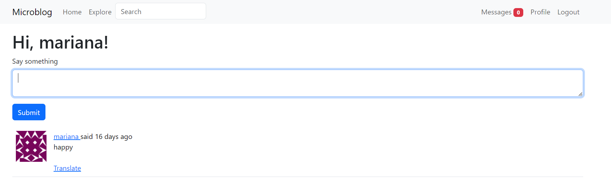

# Microblog

Create a Microblog, witch is a web application with Python and the Flask framework.
Based on the Flask Mega Tutorial from Miguel Grinberg.

## An example of the blog home page



## Instructions on how to start the application

* activate ````activate virtual environment````
* install the requeriments ````pip install -r requirements.txt````
* start ````flask run````
